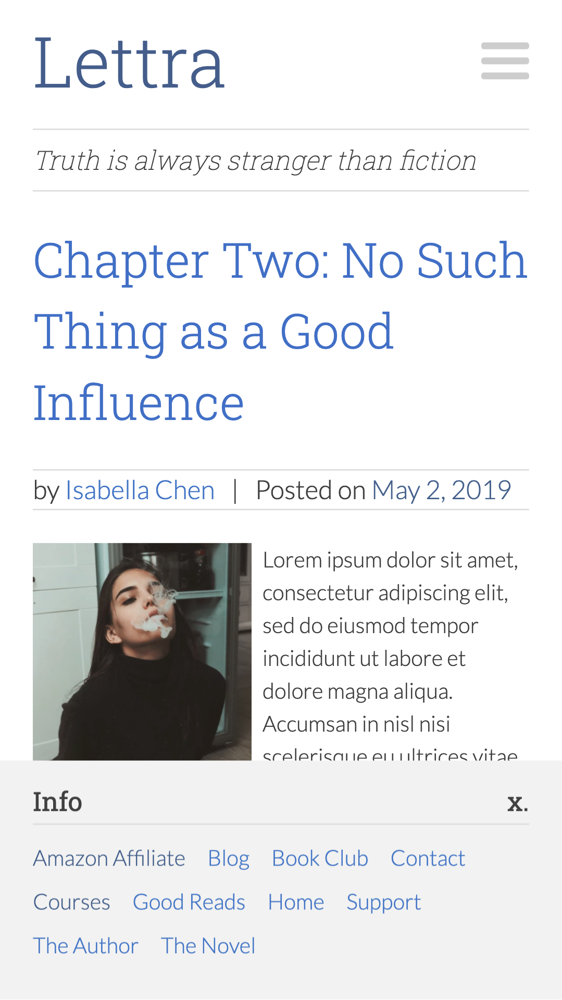
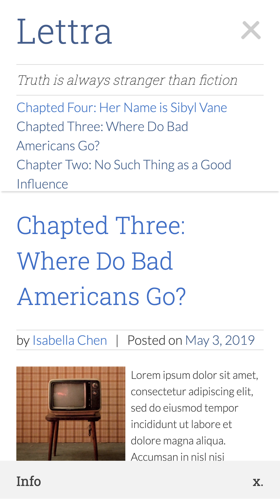
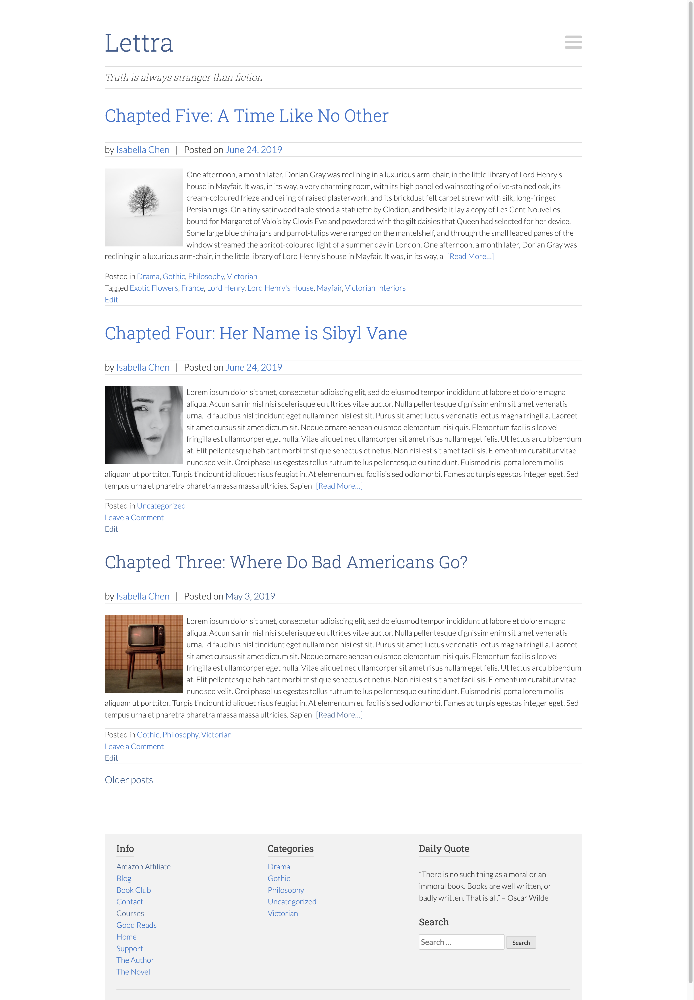
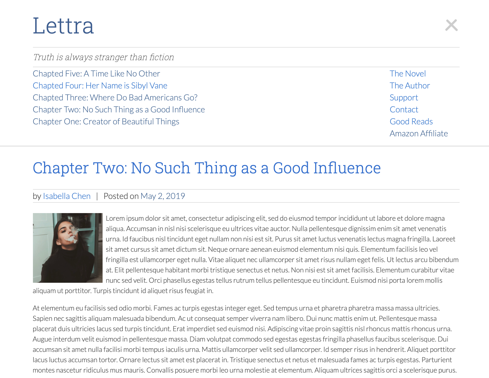

# Lettra

## A WordPress Theme for Writers

Lettra is a WordPress theme for writers. As a fiction writer myself, I found it difficult to find a theme that was specifically designed for fiction. Many WordPress themes place too much emphasis on images, a focus that most writers might not want. Lettra focuses on the text, but includes small featured images to add visual interest. I also wanted to have a menu that was designed to accomodate large number links, in case users wanted to link to all the chapters of a novel. Hence the scrollable navigation. This navigation also has two menu sections, one for the writing and one for meta info (like about, contact, etc.)

## Configuration

Lettra comes with a few customisable areas.

- Two configurable menus
- Three footer widgets
- Customisable fonts and colours

## Design

|                Mobile Screen Footer                 |                     Mobile Screen Menu                      |
| :-------------------------------------------------: | :---------------------------------------------------------: |
|  |  |

### Desktop Layout

